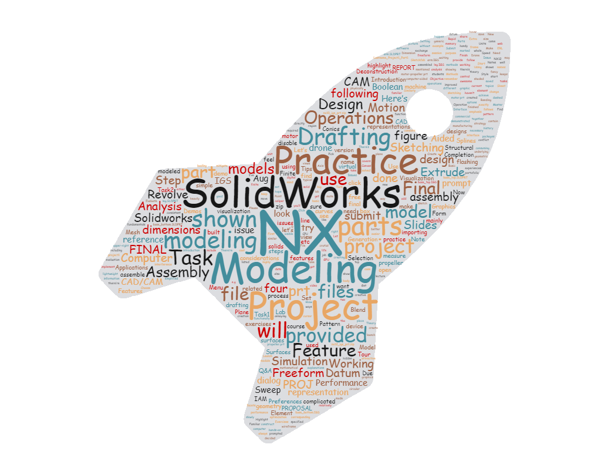

### Course Description

This course (**ME 5763: Computer Aided Design Theory and Practice**) covers the fundamentals (both theory and practice) of computer-aided design with emphasis on geometric modeling and the underlying mathematical representations of curves, surfaces and solids as well as graphic representations. The lecture topics include introduction to digital design and manufacturing, representation of curves, representation of surfaces, representation of solids, CAD/CAM data exchange, and computer graphics. 

**In the lab session, the commercial CAD/CAM packages including NX12 and SolidWorks will be used to provide students with hands-on CAD/CAM experiences through exercises on features creation, sketching, drafting, solid modeling, freeform modeling, assembly modeling, and finite element analysis.**

 

**Lab Instructor**

Wenjin Tao

w.tao@mst.edu

311 [Engineering Research Lab](https://goo.gl/maps/4ASLFqY3Zx62), Missouri University of S&T

Office Hours: M & W 3:00PM-4:00PM

---

### Lab Session Weekly Schedule
**Note**:  This schedule is flexible and may be modified during the semester as needed.

<table>

<colgroup>
<col width="10%" />
<col width="30%" />
<col width="40%" />
<col width="20%" />
</colgroup>
<thead>
<tr class="header">
<th>Week</th>
<th>Lab</th>
<th>Self Exercise</th>
<th>Due Dates</th>
</tr>
</thead>
<tbody>
<tr>
<td markdown="span">Aug. 20</td>
<td markdown="span">Step into Computer Aided Design</td>
<td markdown="span">Design considerations; Deconstruction of complicated design</td>
<td markdown="span"> </td>
</tr>

<tr>
<td markdown="span">Aug. 27</td>
<td markdown="span">NX: Introduction, Form Features and Feature Operations [[Slides]](https://docs.google.com/presentation/d/17NCyl8fK71Y52TaUrHyMorTYWVzYbqFQnhF36DhpPvE/edit?usp=sharing)</td>
<td markdown="span">Extrude, Revolve, Sweep, Blend, Boolean Operations, etc.</td>
<td markdown="span"> </td>
</tr>

<tr>
<td markdown="span">Sep. 10</td>
<td markdown="span">NX: Tips for Sketching and Modeling [[Slides]](https://docs.google.com/presentation/d/10Z4NiW1LA7B2b7xos6fdZAuiIAQcPCOns2jknvkuEcQ/edit?usp=sharing)</td>
<td markdown="span">Practice for Project 1 Task 1</td>
<td markdown="span">[P1 Task1](pages/project-1.html): Sep. 14</td>
</tr>

<tr>
<td markdown="span">Sep. 17</td>
<td markdown="span">NX: Drafting and Assembly Modeling</td>
<td markdown="span">Practice for Project 1 Task 2</td>
<td markdown="span">[P1 Task2](pages/project-1.html): Sep. 21</td>
</tr>

<tr>
<td markdown="span">Sep. 24</td>
<td markdown="span">NX: Freeform Modeling</td>
<td markdown="span">Modeling of Conics, Splines and Surfaces</td>
<td markdown="span">FINAL PROJ. PROPOSAL: Sep. 28</td>
</tr>

<tr>
<td markdown="span">Oct. 1</td>
<td markdown="span">NX: Motion Simulation</td>
<td markdown="span">Motion Simulation and Practice for Project 2</td>
<td markdown="span">P2: Oct. 5</td>
</tr>

<tr>
<td markdown="span">Oct. 8</td>
<td markdown="span">NX: Finite Element Analysis</td>
<td markdown="span">Mesh Generation and Analysis for Structural Applications</td>
<td markdown="span"> </td>
</tr>

<tr>
<td markdown="span">Oct. 15</td>
<td markdown="span">SolidWorks</td>
<td markdown="span">Feature Operations, Sketching, Drafting and Practice for Project 3</td>
<td markdown="span">P3: Oct. 19</td>
</tr>

<tr>
<td markdown="span">Oct. 22</td>
<td markdown="span">SolidWorks</td>
<td markdown="span">Assembly Modeling</td>
<td markdown="span"> </td>
</tr>

<tr>
<td markdown="span">Oct. 29</td>
<td markdown="span">SolidWorks</td>
<td markdown="span">Freeform Modeling and Practice for Project 4</td>
<td markdown="span">P4: Nov. 2</td>
</tr>

<tr>
<td markdown="span">Nov. 5</td>
<td markdown="span">NX: CAM</td>
<td markdown="span">CAM Practice and Working on Final Project</td>
<td markdown="span"> </td>
</tr>

<tr>
<td markdown="span">Nov. 12</td>
<td markdown="span">Q&A for final project</td>
<td markdown="span">Working on Final Project</td>
<td markdown="span"> </td>
</tr>

<tr>
<td markdown="span">Nov. 26</td>
<td markdown="span">IAM Lab Tour & Demos</td>
<td markdown="span">Completion of Final Project</td>
<td markdown="span">FINAL PROJ. REPORT: Nov. 30</td>
</tr>

</tbody>
</table>

---

### <a class="anchor" id="projects">Project Assignments</a>

- [Project 1 Task 1](pages/project-1.html#task-1) --------------------------- **Due: Sep. 14**
- [Project 1 Task 2](pages/project-1.html#task-2) --------------------------- **Due: Sep. 21**
- [Final Project Proposal](#) ------------------ **Due: Sep. 28**
- [Project 2](pages/project-2.html) ------------------------------------ **Due: Oct. 5**
- [Project 3](pages/project-3.html) ------------------------------------ **Due: Oct. 19**
- [Project 4](pages/project-4.html) ------------------------------------ **Due: Nov. 2**
- [Final Project Report](#) --------------------- **Due: Nov. 30**

***Note: Please submit your projects via [Canvas](https://mst.instructure.com/courses/32546/assignments).***

---
### Grading

Problem Sets 	15%

***Lab Projects 		20%***

***Final Project		20%***

Mid-term Exam 	20%

Final Exam 		25%

----

### <a class="anchor" id="tutorial">NX 12 Tutorial</a>

- [NX Modeling](pages/nx-tutorial/nx-modeling.html)
- [NX Drafting](pages/nx-tutorial/nx-drafting.html)
- [How to Speed up Your NX](pages/speed-up-nx.html)

---

### SOLIDWORKS

tba

---

### Books
#### > NX 10
[NX 10 for Engineering Design](https://web.mst.edu/~mleu/nx_manuals/nx10.pdf)

#### > NX 12
[NX 12 for Engineering Design](assets/books/NX-12-for-Engineering-Design.pdf)
 

