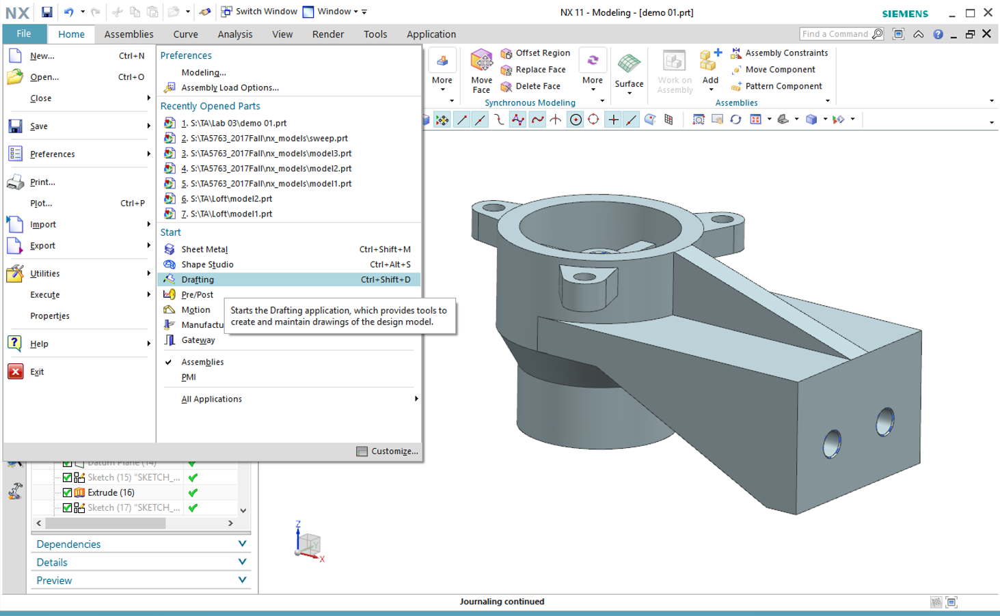
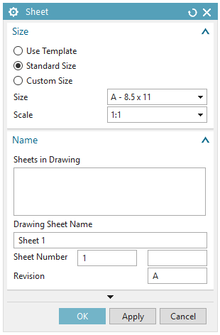
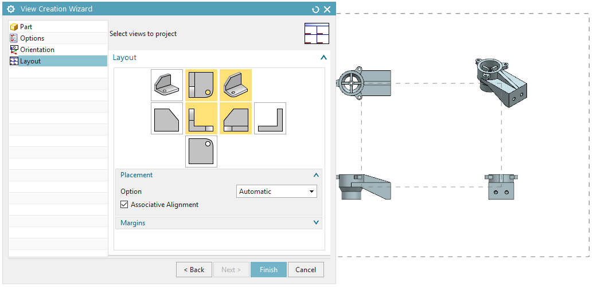
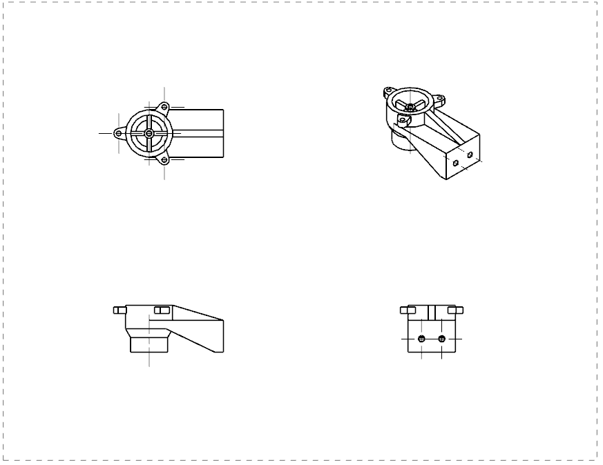
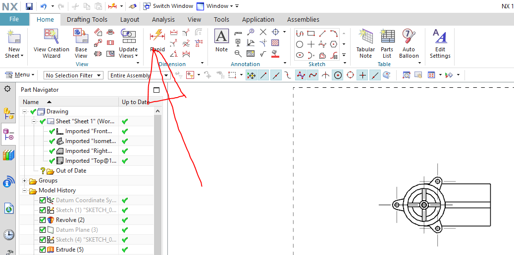

### Drafting

After you have your part done, let's move on to the **Drafting** part of this project.

1. File.
2. Launch **Drafting**.
3. Let's set the Sheet size.  
4. Pick the views you need.
5. Click **Finish**.
6. Now you should have the basic drafting as shown below. 
7. Set Rending Style for a view. For example, if we want to change the upper-right wireframe view to shaded mode, we can follow the steps shown in the figure. 
8. Set the hidden line to visible dashed line. 
9. Use 'Rapid Dimension' to add dimensions.  

#### Here's a video shows the above steps. 

<iframe width="560" height="315" src="https://www.youtube.com/embed/lbe8Eidy0T8" frameborder="0" allow="autoplay; encrypted-media" allowfullscreen></iframe>

