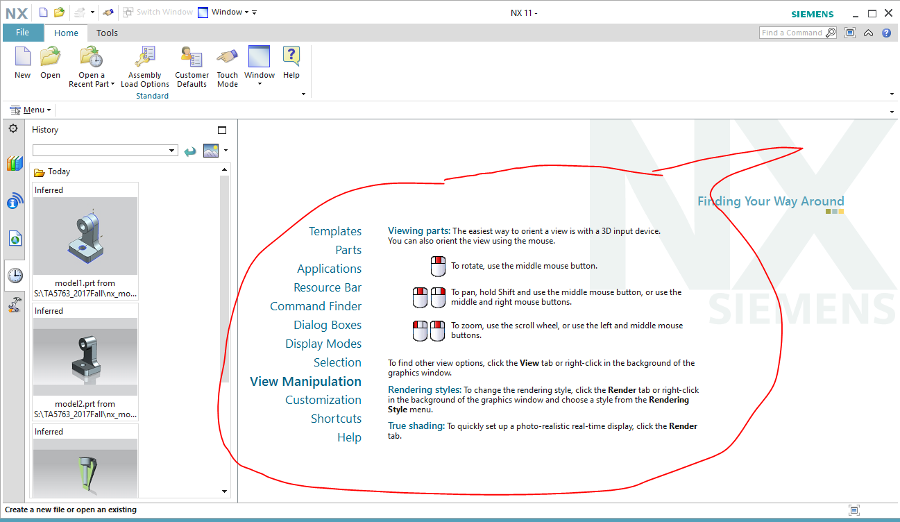
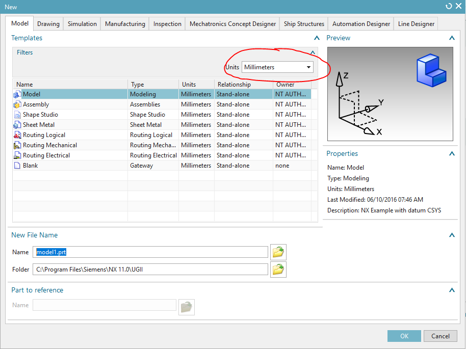
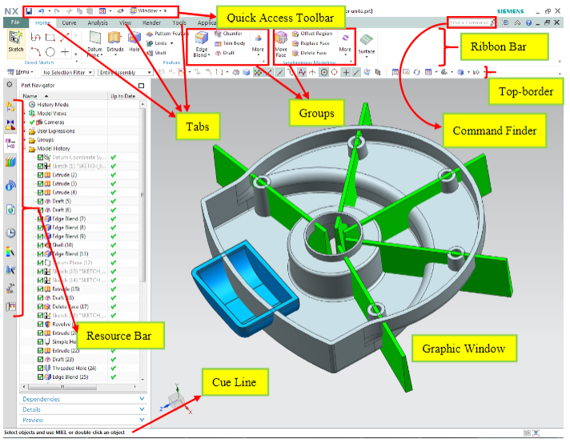
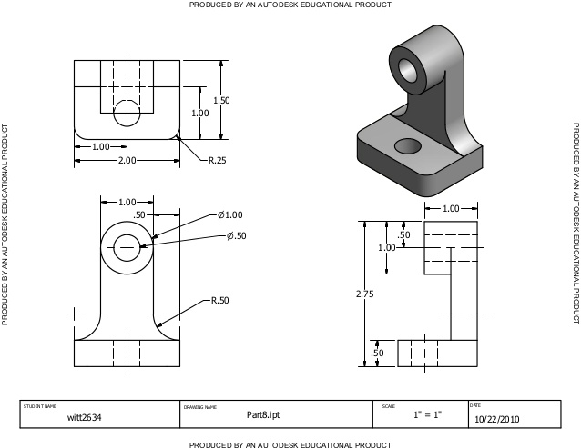
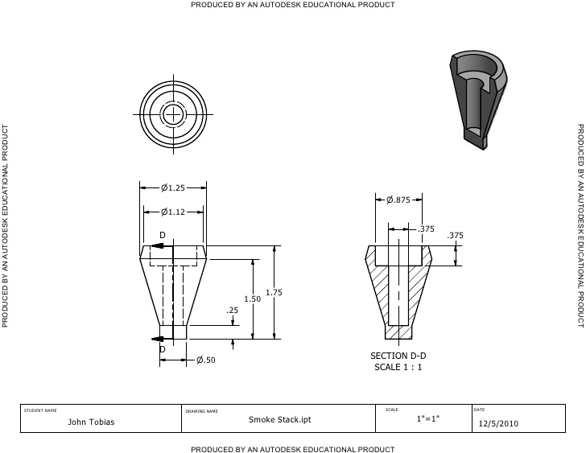
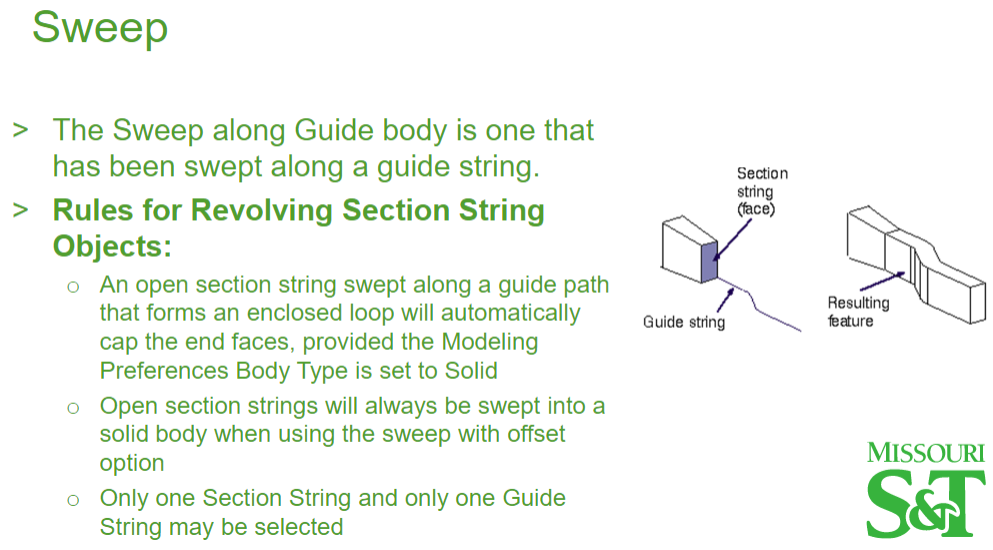
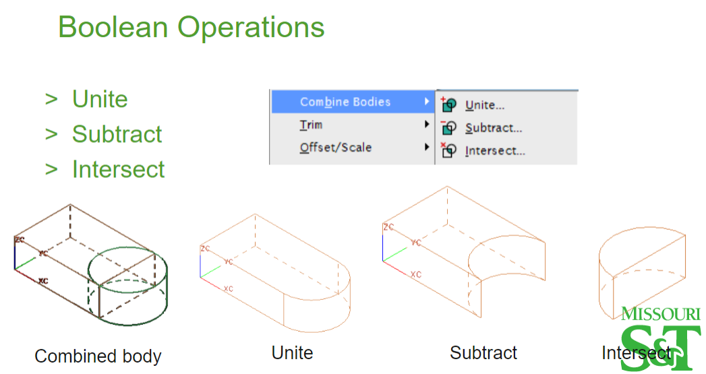

### First of all, let's Start NX

1. Find NX in your device and start it. 
2. There's some simple explanations prompted in the central region (as marked in the following figure). Please go through them if you haven't done this before. 

3. Create a new model file from "New". Note that the "Units" is specified in this dialog.

### Get Familiar with the Interface

A typical interface is shown in the following figure. Take a look to have a big picture in mind.

### Basic Modeling Methods You Need to Master

Some most heavily used  modeling methods are listed and demonstrated as follows.

#### > Extrude

The following part is built mainly by Extrude. Have a try.

<figure class="video_container">
  <iframe width="560" height="315" src="https://www.youtube.com/embed/v-XY5_FhXM0?rel=0" frameborder="0" allow="autoplay; encrypted-media" allowfullscreen></iframe>
</figure>

#### > Revolve
The following part is built mainly by Revolve. Have a try.

#### > Sweep

#### > Boolean Operation

#### > Pattern Feature

Use "Pattern Feature" to make life easier. Here's a demo of using circular pattern.

[tba](#)

#### > Datum Plane

You will find a datum plane is very handy from where you can create the sketch. Here's a demo of creating "Datum Plane". Similarly, you can use "Datum Axis" or "Datum Point" as reference geometry.

#### > Extra Exercises

[Here](https://www.slideshare.net/P1666/multiviews) you can practice a few more simple exercises for you to get familiar with NX.