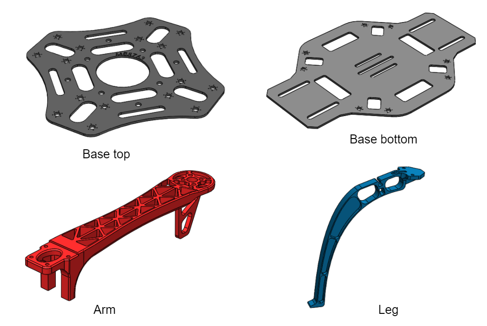

## Objective

In this project, you will be modeling four parts of a drone using NX. These four parts are show below:

These four parts will construct the body frame of a drone. Let's take a look:

<iframe width="640" height="480" src="https://sketchfab.com/models/b0d3f97d518b4cfc89c9ff8857c29865/embed?autospin=0.2&amp;autostart=1" frameborder="0" allow="autoplay; fullscreen; vr" mozallowfullscreen="true" webkitallowfullscreen="true"></iframe>

Very cool, right? I hope after this course, you'll have some fancy CAD designs in your portofolio, which will be attractive when you look for a job. The above awesome 3D visualization is provided by **Sketchfab**, which is a good place to share your 3D designs on the web, [feel free to have a try](https://skfb.ly/6AYHv).

The models in `.IGS` version are provided for your reference. You can use either NX or Solidworks to open the `.IGS` file and measure the necessary dimensions.
- [base_top.IGS](../assets/models/project-1/base_top.IGS)
- [base_bottom.IGS](../assets/models/project-1/base_bottom.IGS)
- [arm.IGS](../assets/models/project-1/arm.IGS)
- [leg.IGS](../assets/models/project-1/leg.IGS)

Or, if you want to measure the parts physically with a caliper, they are waiting in 311 ERL.

If you have **issues on importing** the `.IGS` files into NX or Solidworks. I've done the importing for you and saved the `.prt` files which you can directly open in NX 10 or NX 12.

- [nx10_igs_prt.zip](../assets/models/project-1/nx10_igs_prt.zip)
- [nx12_igs_prt.zip](../assets/models/project-1/nx12_igs_prt.zip)

The models created in Solidworks 2017 are also provided. The Solidworks files contain my modeling history, feel free to use it as reference, but remember to be creative, there's got to be a better way to achieve the same geometry in CAD.

- [base_top.SLDPRT](../assets/models/project-1/base_top.SLDPRT)
- [base_bottom.SLDPRT](../assets/models/project-1/base_bottom.SLDPRT)
- [arm.SLDPRT](../assets/models/project-1/arm.SLDPRT)
- [leg.SLDPRT](../assets/models/project-1/leg.SLDPRT)

***Let me know if you have any issues on loading the provided models. Issues may happen because of the version confict.***

## Notes
- This is an ***NX*** project, so model the parts in ***NX***.
- The unit of the provided model is ***mm***.
- It is not required to have exactly the same dimensions with the provided models. But make sure that your model have the similar features.
- There're some crutial dimensions related to **mate** which you need to keep them consistent for different parts. Make sure that the four parts can be assembled as shown above without interference.

## What to submit?
- Four part files (.prt) in a .zip file.

## How to submit?
- Submit your project to the corresponding module on Canvas (use your last name to name the file (e.g. Lastname_Project1_Part1). Do not use generic names like project1).

 

### If you have any questions? Leave your doubts below <i class="fas fa-arrow-down"></i>