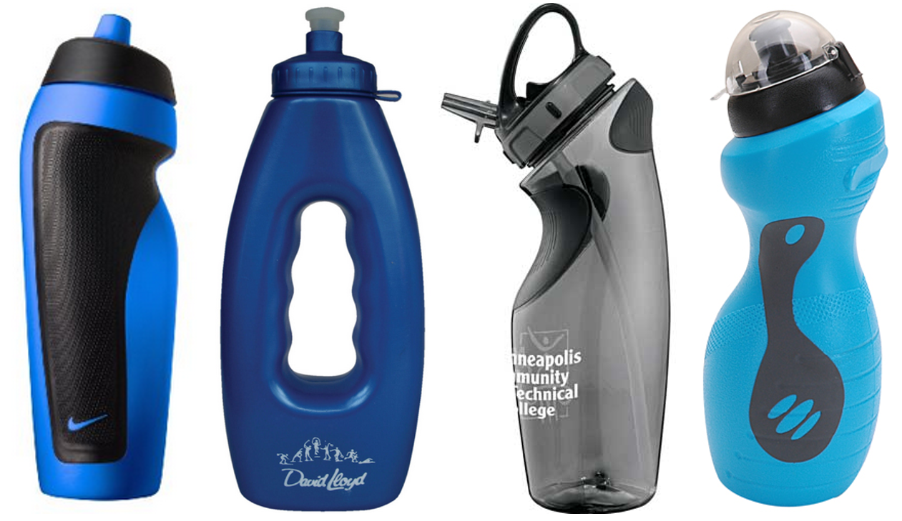

## Objective

Designing and modeling of a sport water bottle.

## Notes

1. Design a sport water bottle (below are some pictures for your reference).
2. Use surface features in NX (such as curves and surfaces) to model it.
3. You do NOT need to model the cap in a separate file.
4. You do NOT need to design a complex part; something similar to the examples is enough.

## What to submit?

Model the bottle, then submit the part file (`.prt`) in a .zip file. **Due: Oct. 4**

## How to submit?

- Submit your project to the corresponding module on Canvas (use your last name to name the file, such as `Lastname_Project1`. Do not use generic names like `project1`).
