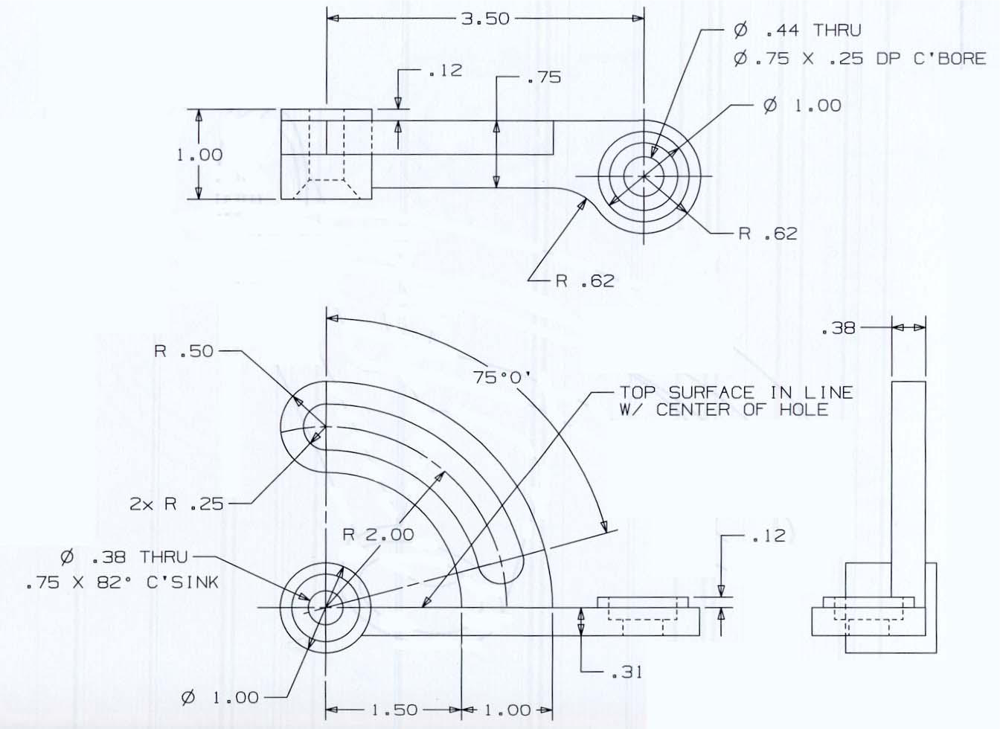
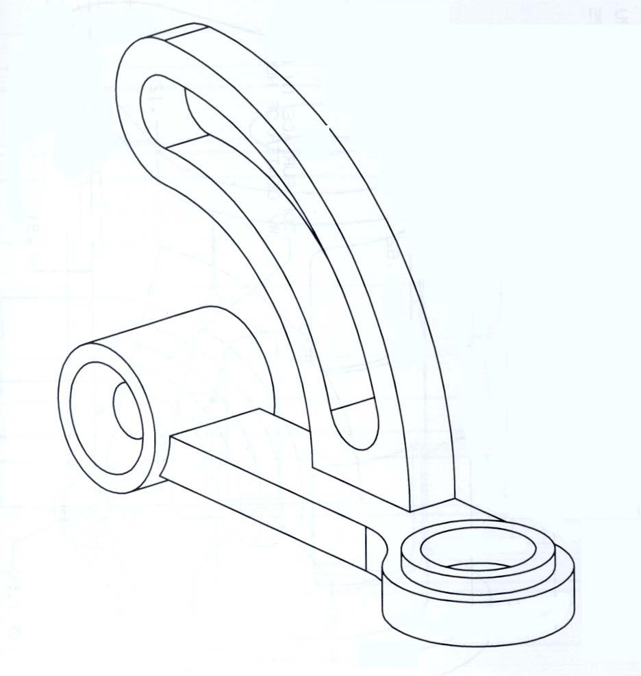
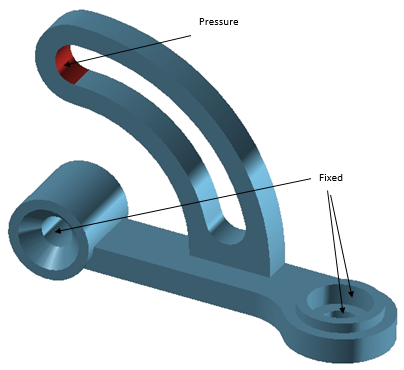

## Objective

Structural analysis of a rocker arm.

## Modeling

Model the following part using NX (Unit: ***Inch***)

​    

## Finite Element Analysis

#### Material properties: 

- Young’s modulus: 3.0 × 107 psi
- Poisson’s ratio: 0.29
- Mass density: 7.35 × 10-4 slug/in3 (*unit conversion may be needed*)

#### Mesh the rocker arm using the following attributes as four different cases:

1. **Tetra 4** elements, element size – **0.2**
2. **Tetra 4** elements, element size – **0.05**
3. **Tetra 10** elements, element size – **0.2**
4. **Tetra 10** elements, element size – **0.05**

#### Boundary conditions: 

Fix both the counter bore hole and the counter sunk hole (i.e. fix the cylindrical faces) as shown in the figure below

#### Apply a pressure load of magnitude 600 psi normal to the face shown

#### For each of the four cases, obtain the (nodal) deflection and (elemental) Von-Mises stress

## Drafting

Recreate the drawing above through the drafting application in NX.

## What to submit?

Part file, drawing of the part similar to the one shown above, and a written report containing the four cases below. The reports do not need to be formal and should be as concise as possible. At the beginning of your document, please tabulate the results of the four cases including the maximum deflections and Von-Mises stresses.

- Meshed solid
- Magnitude of deflection contour
- Von-Mises stress contour
- Brief answers to the following questions:
  - What are the maximum deflection and the maximum stress for each of the four cases?
  - Which of the four cases provides the most accurate results?
  - How are the FEA results affected by the type element and the element size?

## How to submit?

- Submit your project report to the corresponding module on Canvas (use your last name to name the file, such as `Lastname_Project1`. Do not use generic names like `project1`).
