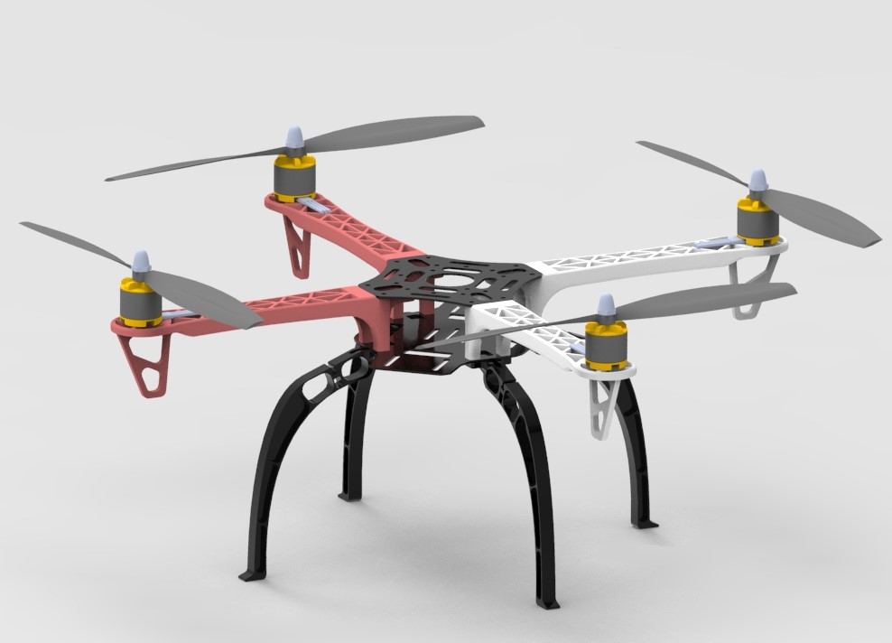
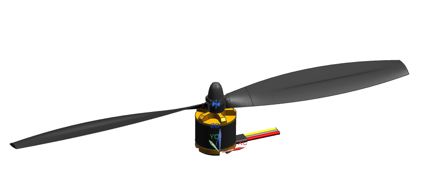

## Objective

Modeling **(1) a motor** and **(2) a propeller** (optional: **(3) acorn nut** if you want to model it separately) then assemble the whole drone (see figure below) in **SolidWorks**.

In [Project 1](project-1.html), the **motor** and **propeller** models (NX 12 `.prt` files) are provided which you can use as reference. *Note that the motor and the propeller are modeled only for assembly purpose, which are highly simplified, they are not functionally modeled.* 

**Feel free to use [GrabCAD](https://grabcad.com/) to find more fancy designs as your reference.**

- [motor.prt](../assets/models/project-1/motor.prt)
- [propeller.prt](../assets/models/project-1/propeller.prt)
- [motor-propeller.prt](../assets/models/project-1/motor-propeller.prt)

The following four models created in SolidWorks 2017 are also provided which you can use for assembly modeling.

- [base_top.SLDPRT](../assets/models/project-1/base_top.SLDPRT)
- [base_bottom.SLDPRT](../assets/models/project-1/base_bottom.SLDPRT)
- [arm.SLDPRT](../assets/models/project-1/arm.SLDPRT)
- [leg.SLDPRT](../assets/models/project-1/leg.SLDPRT)

***Let me know if you have any issues on loading the provided models. Issues may happen because of the version conflict.***

## Notes

- This is an ***SolidWorks*** project, so model the parts in ***SolidWorks***.
- The unit of the provided model is ***mm***.
- It is not required to have exactly the same dimensions with the provided models. But make sure that your model have the similar features.
- There're some crucial dimensions related to **mate** which you need to keep them consistent for different parts. Make sure that the four parts can be assembled as shown above without interference.

## What to submit?

- Model the the necessary parts and assemble the drone, then submit all the part files (`.prt`) and the assembly file (`.prt`) in a .zip file. **Due: Nov. 2**

## How to submit?

- Submit your project to the corresponding module on Canvas (use your last name to name the file (e.g. Lastname_Project1_Part1). Do not use generic names like project1).