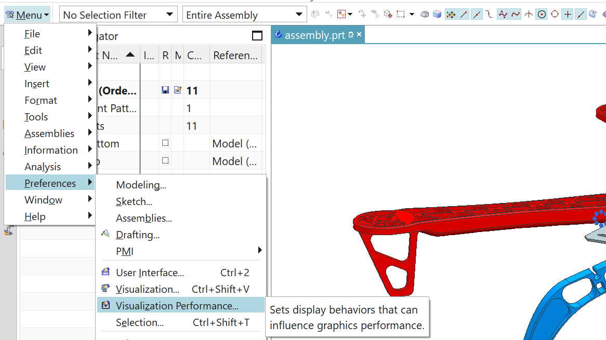
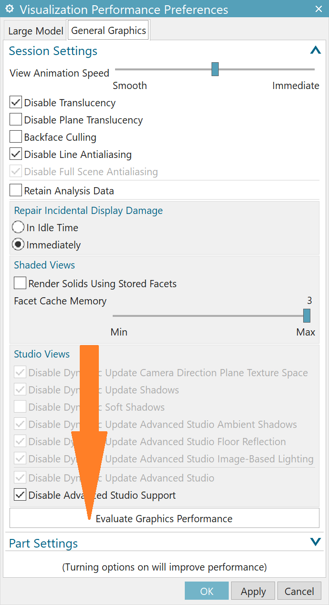
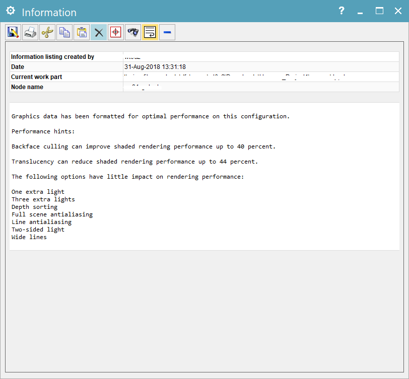
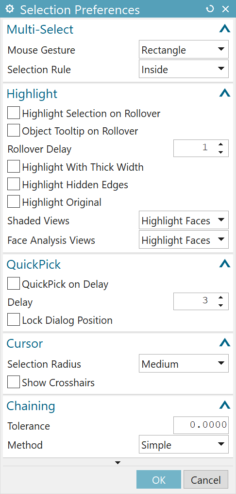

### The Issue

Computer Graphics related software is always CPU, GPU and memory consuming. If you find your NX 12 is working slowly in your current device or virtual machine (figure shown below is the issue I have in my virtual machine, you can see that when I hover my cursor on the model it keeps flashing for a while and I cannot do any other operations), there're a few ways you can do to mitigate the issue.

### Step 1: Setting "Visualization Performance"

Go to **Menu** >> **Preferences** >> **Visualization Performance** (shown below)

In this prompt dialog box, click on **Evaluate Graphics Performance**.

This will launch an evaluation process and implement a performance optimization. After the process is done, you will see the prompt information showing where it has been improved.

### Step 2: Turn off the Selection Highlight

In my case, the annoying flashing facets (shown at the top) come from the **highlight** function. So I decided to disable it.

Go to **Menu** >> **Preferences** >> **Selection** (shown below)

In the prompt dialog box, disable all the highlight options, and click on **OK** to save.

Now you should have a relatively lightweight visualization strategy and the issue mentioned above should be solved.